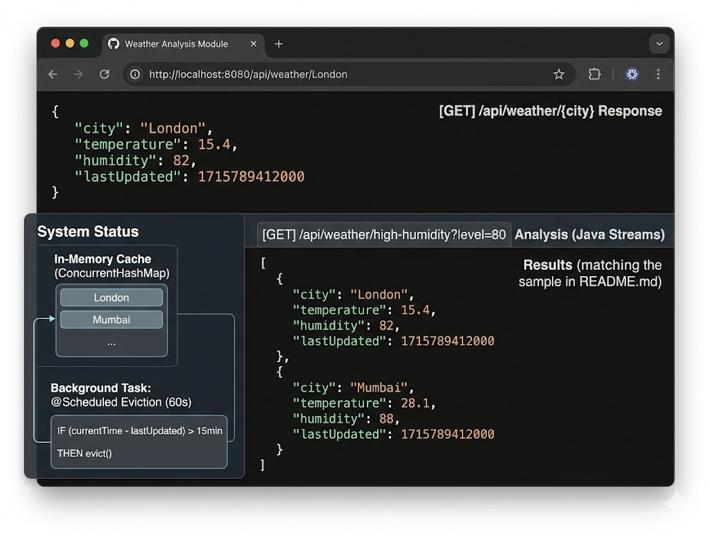

# Weather Analysis Module (Spring Boot)

An enterprise-grade, end-to-end Spring Boot microservice designed to fetch, cache, and analyze real-time weather data. This module demonstrates optimized memory management using concurrent data structures, Stream API processing, and scheduled eviction patterns.

---

## 🚀 Key Features & Architecture

* **Decoupled Multi-Layer Architecture:** Follows clean enterprise patterns with clear separation across Controller, Service, Model, DTO, and Exception boundaries.
* **High-Performance In-Memory Caching:** Utilizes a thread-safe `ConcurrentHashMap` to store high-speed weather lookups, minimizing external network latency.
* **Advanced Data Processing:** Leverages the modern **Java Stream API** to execute declarative filtering, mapping, and high-humidity threshold analysis.
* **Automated Cache Maintenance:** Implements an asynchronous `@Scheduled` background task running an eviction algorithm to proactively wipe out stale data (entries older than 15 minutes) and prevent unbounded memory growth.
* **Unified Error Boundaries:** Implements a global `@RestControllerAdvice` exception layer that intercepts runtime faults (e.g., city missing, infrastructure timeouts) and transforms them into clean, standardized HTTP responses.

---

## 🛠️ Tech Stack

* **Backend Framework:** Spring Boot 3.x
* **Java Version:** Java 17 / 21
* **Build Tool:** Maven (Wrapper included)
* **Core APIs:** Java Streams, Concurrency Utilities, Spring Scheduling, RestTemplate

---

## ⚙️ Configuration & Installation

### 1. Prerequisites
Ensure you have Java 17 (or higher) and Maven installed on your local environment.

### 2. Properties Setup
The module is built with property fallbacks to ensure environment stability even without a live external API key. To connect to a live weather stream, update `src/main/resources/application.properties`:

```properties
weather.api.url=https://api.openweathermap.org/data/2.5/weather
weather.api.key=YOUR_OPENWEATHERMAP_API_KEY
```

### 3. Build & Package
To run a clean compilation and bundle the application into an executable JAR file, run the following command from the root directory:

```bash
./mvnw clean package -DskipTests
```

---

## 🔌 API Endpoints

### 1. Fetch & Cache Weather Data
Sends a request to pull the current data for a specific location. If valid, maps the payload and updates the in-memory cache.

**URL:** `/api/weather/{city}`  
**Method:** `GET`  
**Path Parameters:** `city` (string) - Name of the city

**Response Example:**
```json
{
  "city": "London",
  "temperature": 15.4,
  "humidity": 82,
  "lastUpdated": 1715789412000
}
```

### 2. Stream-Based High Humidity Analysis
Analyzes cached data using Stream pipelines to extract all metrics exceeding a requested threshold level.

**URL:** `/api/weather/high-humidity`  
**Method:** `GET`  
**Query Parameters:** `threshold` (integer) - Humidity percentage threshold (0-100)

**Response Example:**
```json
[
  {
    "city": "London",
    "temperature": 15.4,
    "humidity": 82,
    "lastUpdated": 1715789412000
  }
]
```

---

## 🧹 Background Maintenance (Eviction Logic)

To maintain a lightweight memory footprint, a scheduled background worker wakes up every 60 seconds to clean the cache. It processes the dataset as a stream, filtering out entries older than 15 minutes, and safely removes them from the concurrent map without blocking active requests.

**Key Benefits:**
- Prevents unbounded memory growth
- Runs asynchronously without blocking API traffic
- Uses efficient Stream-based filtering for stale entry detection

---

## 📋 Project Structure

```
src/main/java/com/weather/
├── controller/
│   └── WeatherController.java
├── service/
│   └── WeatherService.java
├── model/
│   └── Weather.java
├── dto/
│   └── WeatherDTO.java
├── exception/
│   ├── WeatherException.java
│   └── GlobalExceptionHandler.java
└── WeatherAnalysisApplication.java

src/main/resources/
└── application.properties
```

---

## 🚀 Getting Started

1. **Clone the repository:**
   ```bash
   git clone https://github.com/heeralsheth/weather-analysis-spring-boot.git
   cd weather-analysis-spring-boot
   ```

2. **Set your OpenWeatherMap API key** in `application.properties`

3. **Build and run:**
   ```bash
   ./mvnw spring-boot:run
   ```

4. **Test the API:**
   ```bash
   curl http://localhost:8080/api/weather/London
   curl "http://localhost:8080/api/weather/high-humidity?threshold=70"
   ```

---

## 📝 License

This project is open source and available under the MIT License.
